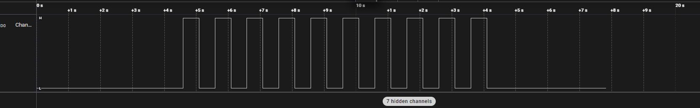
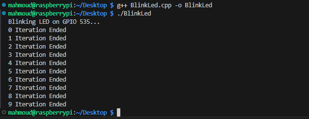

# Blink LED Project

GPIO-controlled LED blinking examples for Raspberry Pi using multiple implementation approaches.

## Project Structure

```
Blink_Led/
├── cpp/
│   └── blink_led_gpiod.cpp    # C++ with libgpiod v2
├── python/
│   └── blink_led_gpiod.py     # Python with gpiod
├── sysfs/
│   └── blink_led_sysfs.cpp    # Direct sysfs interface
├── images/
│   ├── logic_analyzer.png
│   └── terminal_output.png
├── CMakeLists.txt
└── README.md
```

## Hardware Setup

| Component | Connection                                  |
| --------- | ------------------------------------------- |
| LED (+)   | GPIO 23 (Physical Pin 16) via 330Ω resistor |
| LED (-)   | GND (Physical Pin 14)                       |

## Implementations

### 1. libgpiod (Recommended)

Modern approach using the `libgpiod` library for GPIO access.

```bash
# Build
mkdir build && cd build
cmake ..
make

# Run
sudo ./blink_led_gpiod
```

### 2. Python

Simple Python implementation using the gpiod library.

```bash
# Install dependencies
pip install libgpiod-dev

# Run
sudo python3 python/blink_led_gpiod.py
```

### 3. sysfs (Legacy)

Direct filesystem-based GPIO control (deprecated but educational).

```bash
# Build
g++ sysfs/blink_led_sysfs.cpp -o blink_led_sysfs

# Run
sudo ./blink_led_sysfs
```

## Dependencies

```bash
# C++ development
sudo apt-get install libgpiod-dev

# Python
pip install gpiod
```

---

## Demo

|      Logic Analyzer Output      |      Terminal Output      |
| :-----------------------------: | :-----------------------: |
|  |  |
